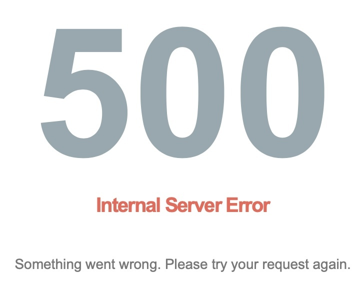

# [RTU MIREA schedule bot](https://t.me/schedule_memrea_bot)
***
### Requirements:
| Library          | Version |
| ---------------- | ------- |
| PyTelegramBotAPI | 3.7.6   |
| psycopg2-binary  | 2.8.6   |
| requests         | 2.25.1  |

***
### Variables:
| Variable | Value                  |
| -------- | ---------------------- |
| TOKEN    | Telegram bot token     |
| DB       | Database name          |
| DB_user  | Database user          |
| DB_port  | Database port          |
| DB_pass  | Database user password |
| DB_host  | Database host          |

## Run dev in docker

1. Create `.env` file

    ```env
    TELEGRAM_BOT_TOKEN=telegram bot token
    ```

2. Run app

    ```bash
    docker-compose up bot
    ```

## Build production stack file

1. Fill `env.prod.ps1` file

    ```powershell
    $Env:TELEGRAM_BOT_TOKEN="telegram bot token"
    $Env:DB_NAME="prodction db name"
    $Env:DB_HOST="production db host"
    $Env:DB_PORT="production db port"
    $Env:DB_USER="production db user"
    $Env:DB_PASSWORD="production db password"
    ```

2. Run `genStack.ps1` script

    ```bash
    # Windows
    ./getStack.ps1
    # Linux
    pwsh getStack.ps1
    ```


